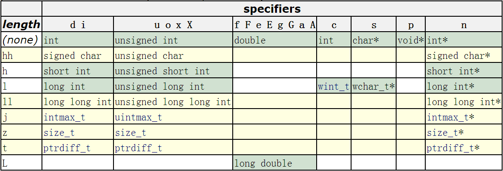

# DAY-2 : 格式化输入输出

## 1.printf()打印函数

### printf 函数

`printf()`函数打印数据的指令要与待打印数据的类型相匹配。例如，打印整数时使用 `%d`，打印字符时使用 `%c` 。这些符号被称为**转换说明**（conversion specification）,它们指定了如何把数据（以2进制形式）转换成可显示的形式。

`格式化字符串`包含三种对象，分别为： 
（1）`字符串常量`； 
（2）`格式控制字符串`； 
（3）`转义字符`

这是 printf（）的格式：

```
printf(格式字符串，待打印项1，待打印项2,...);
```

**待打印项**都是要打印的的项。它们可以是**变量，常量**，甚至是在打印之前计算的**表达式**。

### ⚠️一些说明

C语言的编译器不会检测格式字符串中转换说明中的数量与待打印项总个数是否相匹配。

**1.缺少参数**

```
printf("%d %d\n", i); // wrong
```


printf 会正确显示 i 的值，然后显示一个无意义的整数值。

**2.参数过多**

```
printf("%d\n", i, j);// wrong
```

而在这种情况下，printf 函数会显示变量 i 的值，但是不会显示变量 j 的值

### printf格式控制符格式

printf的格式控制字符串组成如下：

```less
%[flags][width][.prec][length]type
```

即：

```less
%[标志][最小宽度][.精度][类型长度]类型。
```


type用于规定输出数据的类型，含义如下：

| 字符 | 对应数据类型  | 含义                                                         | 示例                                                         |
| :--- | :------------ | :----------------------------------------------------------- | :----------------------------------------------------------- |
| d/i  | int           | 输出十进制有符号32bits整数，i是老式写法                      | `printf("%i",123);`输出123                                   |
| o    | unsigned int  | 无符号8进制(octal)整数(不输出前缀0)                          | `printf("0%o",123);`输出0173                                 |
| u    | unsigned int  | 无符号10进制整数                                             | `printf("%u",123);`输出123                                   |
| x/X  | unsigned int  | 无符号16进制整数，x对应的是abcdef，X对应的是ABCDEF（不输出前缀0x) | `printf("0x%x 0x%X",123,123);`输出0x7b 0x7B                  |
| f/lf | float(double) | 单精度浮点数用f,双精度浮点数用lf(printf可混用，但scanf不能混用) | `printf("%.9f %.9lf",0.000000123,0.000000123);`输出0.000000123 0.000000123。注意指定精度，否则printf默认精确到小数点后六位 |
| F    | float(double) | 与f格式相同，只不过 infinity 和 nan 输出为大写形式。         | 例如`printf("%f %F %f %F\n",INFINITY,INFINITY,NAN,NAN);`输出结果为`inf INF nan NAN` |
| e/E  | float(double) | 科学计数法，使用指数(Exponent)表示浮点数，此处”e”的大小写代表在输出时“e”的大小写 | `printf("%e %E",0.000000123,0.000000123);`输出1.230000e-07 1.230000E-07 |
| g    | float(double) | 根据数值的长度，选择以最短的方式输出，%f或%e                 | `printf("%g %g",0.000000123,0.123);`输出1.23e-07 0.123       |
| G    | float(double) | 根据数值的长度，选择以最短的方式输出，%f或%E                 | `printf("%G %G",0.000000123,0.123);`输出1.23E-07 0.123       |
| c    | char          | 字符型。可以把输入的数字按照ASCII码相应转换为对应的字符      | `printf("%c\n",65)`输出A                                     |
| s    | char*         | 字符串。输出字符串中的字符直至字符串中的空字符（字符串以空字符’\0‘结尾） | `printf("%s","测试test");`输出：测试test                     |
| S    | wchar_t*      | 宽字符串。输出字符串中的字符直至字符串中的空字符（宽字符串以两个空字符’\0‘结尾） | `setlocale(LC_ALL,"zh_CN.UTF-8");` `wchar_t wtest[]=L"测试Test";` `printf("%S\n",wtest);` 输出：测试test |
| p    | void*         | 以16进制形式输出指针                                         | `printf("%010p","lvlv");`输出：0x004007e6                    |
| n    | int*          | 什么也不输出。%n对应的参数是一个指向signed int的指针，在此之前输出的字符数将存储到指针所指的位置 | `int num=0;` `printf("lvlv%n",&num);` `printf("num:%d",num);` 输出:lvlvnum:4 |
| %    | 字符%         | 输出字符‘%’（百分号）本身                                    | `printf("%%");`输出:%                                        |
| m    | 无            | 打印errno值对应的出错内容                                    | `printf("%m\n");`                                            |
| a/A  | float(double) | 十六进制p计数法输出浮点数，a为小写，A为大写                  | `printf("%a %A",15.15,15.15);`输出：0x1.e4ccccccccccdp+3 0X1.E4CCCCCCCCCCDP+3 |

### 标志（flags）

flags规定输出样式，取值和含义如下：

| 字符  | 名称   |                             说明                             |
| :---: | :----- | :----------------------------------------------------------: |
|   -   | 减号   |      结果左对齐，右边填空格。默认是右对齐，左边填空格。      |
|   +   | 加号   |                     输出符号(正号或负号)                     |
| space | 空格   |             输出值为正时加上空格，为负时加上负号             |
|   #   | 井号   | type是o、x、X时，增加前缀0、0x、0X。 type是a、A、e、E、f、g、G时，一定使用小数点。默认的，如果使用.0控制不输出小数部分，则不输出小数点。 type是g、G时，尾部的0保留。 |
|   0   | 数字零 | 将输出的前面补上0，直到占满指定列宽为止（不可以搭配使用“-”） |

```c
printf("%5d\n",1000);               //默认右对齐,左边补空格
printf("%-5d\n",1000);              //左对齐,右边补空格
 
printf("%+d %+d\n",1000,-1000);     //输出正负号
 
printf("% d % d\n",1000,-1000);     //正号用空格替代，负号输出
 
printf("%x %#x\n",1000,1000);       //输出0x
 
printf("%.0f %#.0f\n",1000.0,1000.0)//当小数点后不输出值时依然输出小数点
 
printf("%g %#g\n",1000.0,1000.0);   //保留小数点后后的0
 
printf("%05d\n",1000);              //前面补0
```

`输出结果：`

```c
 1000
1000
+1000 -1000
 1000 -1000
3e8 0x3e8
1000 1000.
1000 1000.00
01000
```

### 输出最小宽度（width）

用十进制整数来表示输出的最少位数。若实际位数多于指定的宽度，则按实际位数输出，若实际位数少于定义的宽度则补以空格或0。width的可能取值如下：

| width | 描述                                                         | 示例                                |
| :---- | :----------------------------------------------------------- | :---------------------------------- |
| 数值  | 十进制整数                                                   | `printf("%06d",1000);`输出:001000   |
| *     | 星号。不显示指明输出最小宽度，而是以星号代替，在printf的输出参数列表中给出 | `printf("%0*d",6,1000);`输出:001000 |

### 精度（.precision）

精度格式符以“.”开头，后跟十进制整数。可取值如下：

| .precision | 描述                                                         |
| :--------- | :----------------------------------------------------------- |
| .数值      | 十进制整数。 (1)对于整型（d,i,o,u,x,X）,precision表示输出的最小的数字个数，不足补前导零，超过不截断。 (2)对于浮点型（a, A, e, E, f ），precision表示小数点后数值位数，默认为六位，不足补后置0，超过则截断。 (3)对于类型说明符g或G，表示可输出的最大有效数字。 (4)对于字符串（s），precision表示最大可输出字符数，不足正常输出，超过则截断。 precision不显示指定，则默认为0 |
| .*         | 以星号代替数值，类似于width中的*，在输出参数列表中指定精度。 |


示例：

```cobol
printf("%.8d\n",1000);          //不足指定宽度补前导0，效果等同于%06d


printf("%.8f\n",1000.123456789);//超过精度，截断


printf("%.8f\n",1000.123456);   //不足精度，补后置0


printf("%.8g\n",1000.123456);   //最大有效数字为8位


printf("%.8s\n",“abcdefghij”);  //超过指定长度截断
```

输出结果：

```cobol
00001000


1000.12345679


1000.12345600


1000.1235


abcdefgh
```

**注意，**在对浮点数和整数截断时，存在四舍五入。

### 转义字符

转义字符在字符串中会被自动转换为相应操作命令。printf()使用的常见转义字符如下：

| 转义字符 | 意义           |
| :------- | :------------- |
| \a       | 警报（响铃）符 |
| \b       | 回退符         |
| \f       | 换页符         |
| \n       | 换行符         |
| \r       | 回车符         |
| \t       | 横向制表符     |
| \v       | 纵向制表符     |
| \\       | 反斜杠         |
| \”       | 双引号         |

### 类型长度

类型长度指明待输出数据的长度。因为相同类型可以有不同的长度，比如整型有16bits的short int，32bits的int，也有64bits的long int，浮点型有32bits的单精度float和64bits的双精度double。为了指明同一类型的不同长度，于是乎，类型长度（length）应运而生，成为格式控制字符串的一部分。


### 自己的一些小记录

```c
#include <stdio.h>
#include <math.h>
int main(){
    int i,j,k;
    i = 1+2;
    j = 1+2*3;
    k = i + j + -1 + pow(2,3);
    printf("i %d j %d k %d",i,j,k);
    //向大转型 1.0 + 2 ==1.0 + 2.0；
    //在表达式前面加(数据类型)可以强制转化 ，整型
// i = 10;
//float f;
//f = (float)i; // 强制转换int为float类型
    return 0;
}
```



示例代码：

```perl
printf("%hhd\n",'A');               //输出有符号char


printf("%hhu\n",'A'+128);           //输出无符号char


printf("%hd\n",32767);              //输出有符号短整型short int


printf("%hu\n",65535);              //输出无符号短整型unsigned short int


printf("%ld\n",0x7fffffffffffffff); //输出有符号长整型long int


printf("%lu\n",0xffffffffffffffff); //输出有符号长整型unsigned long int
```

输出结果：

```cobol
65


193


32767


65535


9223372036854775807


18446744073709551615
```

**注意：** 
long int到底是32bits还是64bits跟生成的程序是32bits还是64bits一一对应，如果使用g++编译程序的话，可通过`-m32`或`-m64`选项分别生成32bits和64bits的程序。因本人测试代码编译生成的是64bits的程序，所以long int也就是64btis。

## 2.scanf()输入函数

> **函数声明：**
>
> ```c
> # include <stdio.h>
> int scanf(const char *format, additional arguments);
> ```

 1）该函数需要引用头文件`stdio.h`

const char *format：
 这个参数主要包括两类：格式化输入控制符 或者 输入控制符与非输入控制符的组合
 按第一类格式输入时，第一个参数只输入输入控制符，一般是%+别的符号；

 按第二类格式输入时，第一个参数可以输入自己想要的一些不用作后续操作的输入，但是需要注意，这里你在函数参数中写了什么，就要在键盘输入时输入什么，格式必须保持完全一致。

 additional arguments：
 这些参数应该是指针：为了在常规变量上执行scanf操作并存储结果，其名称前应该加上取地址操作符(&)，这些参数的数量至少应该与格式说明符所存储的值的数量相同。额外的参数会被该函数忽略。

返回的是int型的数据，scanf函数返回成功读入的数据项数，读入数据时遇到了“文件结束”则返回EOF。（EOF是文件结束标志End Of Files）
例如：

> scanf("%d%d", &a, &b);
> 若a和b都读取成功，则返回2。
> 若只有a被成功读入，返回值为1；
> 若a读取失败，返回值为0；
> 若遇到错误或遇到end of file，返回值为EOF

在scanf函数从stdin中读到文件结束，也就是换行符ENTER(键盘输入时每一个键都会被输入)时，会返回EOF，可以利用这一特点输入多组数据，直到按下ENTER

例 输入多组数据

```cint main() {

   int a, b;
   while (scanf("%d %d", &a, &b) != EOF) { // 注意 while 处理多个 case
       printf("%d\n", a + b);
   }
   return 0;
}

输入：20 30 40 50 60 70
接收：三组a，b的值
```


scanf 中 `''%d ''`只识别“十进制整数”。对 '%d '而言，`空格、回车、Tab` 键都是区分数据与数据的分隔符。当 scanf 进入缓冲区中取数据的时候，如果 `%d `遇到空格、回车、Tab 键，那么它并不取用，而是跳过继续往后取后面的数据，直到取到“十进制整数”为止。

但是如果 %d 遇到字母，那么它`不会跳过也不会取用`，而是直接从缓冲区跳出。所以上面这个程序，虽然 scanf 进入缓冲区了，但用户输入的是字母 a，所以它什么都没取到就出来了，而变量 i 没有值，即未初始化，所以输出就是 –858993460。

这里我们可以使用`getchar()`去将冲区错误输入的a给释放掉。

但如果将 %d 换成 %c，那么任何数据都会被当作一个字符，不管是数字还是空格、回车、Tab 键它`都会取回`。

不但如此，前面讲过，你从键盘输入 123，这个不是数字 123，而是字符 ‘1’、字符 ‘2’ 和字符 ‘3’，它们依次排列在缓冲区中。因为每个字符变量 char 只能放一个字符。所以输入“123”之后按回车，scanf 开始进入缓冲区，按照次序，先取字符 ‘1’，如果还要取就再取字符 ‘2’，以此类推。

如果都取完了还有 `scanf `要取数据，那么用户就需要`再输入`。

scanf函数无法接收空格的字符串，它在读到空格时会认为是要去读取下一个数据了，并不会读到空格。
那么我们如何解决这个问题，简单的方法是**使用gets()函数**，它可以直接输入带有空格的字符串。
需要注意的是gets函数在 C11 和 C++14已经不存在了。

```c
#include <stdio.h>

int main(){
	char arr[100];
	scanf("%s", &arr);
	gets(arr);
	printf("%s",arr);
    return 0;
}

```


- `%2d`表示最多读取两位整数；
- `%10s`表示读取的字符串的最大长度为 10，或者说，最多读取 10 个字符。

`%s`可以匹配除空白符以外的所有字符，但不能读取特定的字符，比如只想读取小写字母，或者十进制数字等，`%s` 就无能为力。时可以使用`[]`包含上需要的范围，也就是`%[xxx]`:
比如：%[abcd]表示只读取字符abcd，遇到其它的字符就读取结束；

为了简化字符集合的写法，scanf() 支持使用连字符`-`来表示一个范围内的字符，例如` %[a-z]`、`%[0-9]` 等。

```c
#include <stdio.h>
   int main()
   {
   char str[30];
   scanf("%[a-z]", str);
   printf("%s\n", str);
   
   return 0;
   }

```

使用`*`，可以把读取到的数据直接丢弃，不往变量中存放。
例如：

- `%*d`表示读取一个整数并丢弃；
- `%*[a-z]`表示读取小写字母并丢弃；

```c
#include <stdio.h>
int main()
{
int n;
scanf("%*d %d", &n);
printf("n=%d\n", n);

return 0;
}
input 10 20
result n =20
```

- `%[^\n]`表示匹配除换行符以外的所有字符，遇到换行符就停止读取；
- `%[^0-9]`表示匹配除十进制数字以外的所有字符，遇到十进制数字就停止读取

```c
#include <stdio.h>
 int main() 
 {
	 char a[20];
	 scanf("%[^\n]s", &a);
	 printf("%s\n", a);

}

```


## 3.getchar()字符输入函数

```c
函数原型：int getchar(void);                                 返回类型为int,参数为void

头  文  件：#include<stdio.h>

返  回  值： 1、getchar返回的是字符的ASCII码值（整数）。
                   2、getchar在读取结束或者失败的时候，会返回EOF。

                        (EOF意思是end of file,本质上是-1）

读取方式：只能输入字符型,输入时遇到回车键才从缓冲区依次提取字符。

结束输入的方式：以Enter结束输入（空格不结束），接受空格符。

舍弃回车符的方法：以Enter结束输入时，接受空格，会舍弃最后的回车符
#include<stdio.h>
int main()
{
	char ch ;
	while ((ch=getchar()) != 'EOF')
	{
		putchar(ch);
	}
	return 0;
}                         
```

## 4.putchar()函数

 函数原型定义在 <stdio.h> 头文件中，因此在使用 putchar() 函数之前需要包含这个头文件。

```c#include <stdio.h>
int putchar(int c);
```

参数：

c：要写入标准输出的字符。虽然参数类型是` int`，但实际上只需要传入一个字符即可。这是因为字符在 C 语言中是以`整数形式`存储的，而 putchar() 需要能够处理` EOF`（通常定义为 `-1`），所以参数类型是 int。
返回值：

如果写入成功，返回`写入的字符`（以 int 形式）。
如果发生写入错误，返回 `EOF`（通常定义为` -1`）。

##  5.gets() 函数

 功能描述
        gets() 函数用于从标准输入流 stdin 读取一行字符（直到遇到换行符 \n 或文件结束符 EOF），并将读取的字符存储到指定的字符数组中。换行符 \n 不会被存储到数组中，但在读取过程中会被消耗掉。读取完成后，会在数组末尾添加一个空字符 \0 以终止字符串。

 函数原型
        函数原型定义在 <stdio.h> 头文件中，因此在使用 gets() 函数之前需要包含这个头文件。

```c#include <stdio.h>
char *gets(char *str);

```

参数：

str：指向字符数组的指针，用于存储读取的字符串。
返回值：

成功时，返回 str，即指向读取字符串的指针。
如果遇到文件结束符 EOF 或读取错误，返回 NULL。
案例演示

    #include <stdio.h>
    
    int main()
    {
        char buffer[100]; // 定义一个足够大的字符数组来存储输入的字符串
    printf("请输入一行文本：");
     
    // 读取一行文本
    if (gets(buffer) != NULL)
    {
        printf("您输入的文本是：\n");
        printf("%s\n", buffer); // 使用 printf() 输出字符串
    }
    else
    {
        printf("读取输入时发生错误。\n");
    }
     
    return 0;
}
        输出结果如下所示：


注意事项
        缓冲区溢出风险：gets() 函数不会检查目标数组的大小，如果用户输入的字符串长度超过了数组的容量，会导致缓冲区溢出，从而引发严重的安全问题。因此，强烈建议避免使用 gets()，改用更安全的替代函数，如 fgets()。

        换行符处理：gets() 会读取并消耗换行符 \n，但不会将其存储在目标数组中。如果后续需要处理换行符，需要注意这一点。
    
        结束符处理：gets() 读取完成后，会在数组末尾添加一个空字符 \0 以终止字符串。
    
        错误处理：如果遇到文件结束符 EOF 或读取错误，gets() 会返回 NULL。在程序中应该检查返回值，以正确处理这些情况。
    
        替代函数：推荐使用 fgets() 函数代替 gets()，因为 fgets() 允许指定最大读取长度，从而避免缓冲区溢出的风险。

## 6.puts() 函数

 功能描述
        puts() 是 C 语言标准库中用于将字符串输出到标准输出流 stdout 的函数。与 printf() 不同，puts() 专门用于输出字符串，并且在输出字符串后自动添加一个换行符 \n。

 函数原型
        函数原型定义在 <stdio.h> 头文件中，因此在使用 puts() 函数之前需要包含这个头文件。

#include <stdio.h>
int puts(const char *str);
参数：

str：指向要输出的字符串的指针。
返回值：

成功时，返回非负值（通常是 0 或 1）。
如果输出失败，返回 EOF（通常定义为 -1）。 
 案例演示

    #include <stdio.h>
    
    int main()
    {
        char str[20]; // 定义一个字符数组来存储输入的字符串
    puts("Enter a line of text :");
    gets(str); // 读取一行文本
     
    puts("You entered: ");
    puts(str); // 使用 puts() 输出字符串
     
    return 0;
}


 注意事项
        换行符：puts() 会在输出的字符串末尾自动添加一个换行符 \n。如果不需要换行符，可以使用 fputs() 函数，它不会自动添加换行符。

        错误处理：如果输出失败，puts() 会返回 EOF。在程序中应该检查返回值，以正确处理这些情况。使用 fprintf(stderr, ...) 将错误信息输出到标准错误流 stderr，而不是标准输出流 stdout，以确保错误信息不会与正常输出混淆。
    
        字符串终止符：puts() 要求字符串必须以空字符 \0 终止。如果传入的字符串不是以 \0 终止的，可能会导致未定义行为。

## 7. fgets() 函数

 功能描述
        fgets() 是 C 语言标准库中用于从输入流中读取一行字符的函数。与 gets() 不同，fgets() 允许指定最大读取长度，从而避免缓冲区溢出的风险。fgets() 会读取指定数量的字符（包括换行符 \n），并将读取的字符存储到指定的字符数组中，最后在数组末尾添加一个空字符 \0 以终止字符串。

 函数原型
        函数原型定义在 <stdio.h> 头文件中，因此在使用 fgets() 函数之前需要包含这个头文件。

#include <stdio.h>
char *fgets(char *str, int n, FILE *stream);
参数：

str：指向字符数组的指针，用于存储读取的字符串。
n：要读取的最大字符数（包括终止空字符 \0）。实际读取的字符数最多为 n-1，以确保有足够的空间存储终止空字符。
stream：输入流，通常为 stdin 表示标准输入。
返回值：

成功时，返回 str，即指向读取字符串的指针。
如果遇到文件结束符 EOF 或读取错误，返回 NULL。
案例演示

     #include <stdio.h>
    
    int main()
    {
        char str[100]; // 定义一个足够大的字符数组来存储输入的字符串
     printf("Enter a line of text :");
     
    // 读取一行文本
    if (fgets(str, sizeof(str), stdin) != NULL)
    {
        printf("You entered: ");
        // printf("%s\n", str); // 使用 printf() 输出字符串
        puts(str); // 自动添加一个换行符 \n
    }
    else
    {
        printf("读取输入时发生错误。\n");
    }
     
    return 0;
}
        输出结果如下所示：


 注意事项
        缓冲区溢出保护：fgets() 允许指定最大读取长度，从而避免缓冲区溢出的风险。这使得 fgets() 比 gets() 更安全。实际读取的字符数最多为 n-1，以确保有足够的空间存储终止空字符 \0。

        换行符处理：fgets() 会读取并存储换行符 \n（如果在读取的字符数范围内）。如果需要去除换行符，可以手动处理：

size_t len = strlen(str);
if (len > 0 && str[len - 1] == '\n') {
    str[len - 1] = '\0';
}
        错误处理：如果遇到文件结束符 EOF 或读取错误，fgets() 会返回 NULL。在程序中应该检查返回值，以正确处理这些情况。可以使用 fprintf(stderr, ...) 将错误信息输出到标准错误流 stderr，而不是标准输出流 stdout，以确保错误信息不会与正常输出混淆。
                                                                                                                                  
