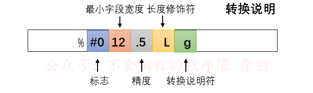
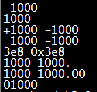

# DAY-2 : 格式化输入输出

## 1.printf()打印函数

### printf 函数

`printf()`函数打印数据的指令要与待打印数据的类型相匹配。例如，打印整数时使用 `%d`，打印字符时使用 `%c` 。这些符号被称为**转换说明**（conversion specification）,它们指定了如何把数据（以2进制形式）转换成可显示的形式。

`格式化字符串`包含三种对象，分别为： 
（1）`字符串常量`； 
（2）`格式控制字符串`； 
（3）`转义字符`

这是 printf（）的格式：

```
printf(格式字符串，待打印项1，待打印项2,...);
```

**待打印项**都是要打印的的项。它们可以是**变量，常量**，甚至是在打印之前计算的**表达式**。

### ⚠️一些说明

C语言的编译器不会检测格式字符串中转换说明中的数量与待打印项总个数是否相匹配。

**1.缺少参数**

```
printf("%d %d\n", i); // wrong
```


printf 会正确显示 i 的值，然后显示一个无意义的整数值。

**2.参数过多**

```
printf("%d\n", i, j);// wrong
```

而在这种情况下，printf 函数会显示变量 i 的值，但是不会显示变量 j 的值

### printf格式控制符格式



printf的格式控制字符串组成如下：

```less
%[flags][width][.prec][length]type
```

即：

```less
%[标志][最小宽度][.精度][类型长度]类型。
```


type用于规定输出数据的类型，含义如下：

| 字符 | 对应数据类型  | 含义                                                         | 示例                                                         |
| :--- | :------------ | :----------------------------------------------------------- | :----------------------------------------------------------- |
| d/i  | int           | 输出十进制有符号32bits整数，i是老式写法                      | `printf("%i",123);`输出123                                   |
| o    | unsigned int  | 无符号8进制(octal)整数(不输出前缀0)                          | `printf("0%o",123);`输出0173                                 |
| u    | unsigned int  | 无符号10进制整数                                             | `printf("%u",123);`输出123                                   |
| x/X  | unsigned int  | 无符号16进制整数，x对应的是abcdef，X对应的是ABCDEF（不输出前缀0x) | `printf("0x%x 0x%X",123,123);`输出0x7b 0x7B                  |
| f/lf | float(double) | 单精度浮点数用f,双精度浮点数用lf(printf可混用，但scanf不能混用) | `printf("%.9f %.9lf",0.000000123,0.000000123);`输出0.000000123 0.000000123。注意指定精度，否则printf默认精确到小数点后六位 |
| F    | float(double) | 与f格式相同，只不过 infinity 和 nan 输出为大写形式。         | 例如`printf("%f %F %f %F\n",INFINITY,INFINITY,NAN,NAN);`输出结果为`inf INF nan NAN` |
| e/E  | float(double) | 科学计数法，使用指数(Exponent)表示浮点数，此处”e”的大小写代表在输出时“e”的大小写 | `printf("%e %E",0.000000123,0.000000123);`输出1.230000e-07 1.230000E-07 |
| g    | float(double) | 根据数值的长度，选择以最短的方式输出，%f或%e                 | `printf("%g %g",0.000000123,0.123);`输出1.23e-07 0.123       |
| G    | float(double) | 根据数值的长度，选择以最短的方式输出，%f或%E                 | `printf("%G %G",0.000000123,0.123);`输出1.23E-07 0.123       |
| c    | char          | 字符型。可以把输入的数字按照ASCII码相应转换为对应的字符      | `printf("%c\n",65)`输出A                                     |
| s    | char*         | 字符串。输出字符串中的字符直至字符串中的空字符（字符串以空字符’\0‘结尾） | `printf("%s","测试test");`输出：测试test                     |
| S    | wchar_t*      | 宽字符串。输出字符串中的字符直至字符串中的空字符（宽字符串以两个空字符’\0‘结尾） | `setlocale(LC_ALL,"zh_CN.UTF-8");` `wchar_t wtest[]=L"测试Test";` `printf("%S\n",wtest);` 输出：测试test |
| p    | void*         | 以16进制形式输出指针                                         | `printf("%010p","lvlv");`输出：0x004007e6                    |
| n    | int*          | 什么也不输出。%n对应的参数是一个指向signed int的指针，在此之前输出的字符数将存储到指针所指的位置 | `int num=0;` `printf("lvlv%n",&num);` `printf("num:%d",num);` 输出:lvlvnum:4 |
| %    | 字符%         | 输出字符‘%’（百分号）本身                                    | `printf("%%");`输出:%                                        |
| m    | 无            | 打印errno值对应的出错内容                                    | `printf("%m\n");`                                            |
| a/A  | float(double) | 十六进制p计数法输出浮点数，a为小写，A为大写                  | `printf("%a %A",15.15,15.15);`输出：0x1.e4ccccccccccdp+3 0X1.E4CCCCCCCCCCDP+3 |

### 标志（flags）

flags规定输出样式，取值和含义如下：

| 字符  | 名称   |                             说明                             |
| :---: | :----- | :----------------------------------------------------------: |
|   -   | 减号   |      结果左对齐，右边填空格。默认是右对齐，左边填空格。      |
|   +   | 加号   |                     输出符号(正号或负号)                     |
| space | 空格   |             输出值为正时加上空格，为负时加上负号             |
|   #   | 井号   | type是o、x、X时，增加前缀0、0x、0X。 type是a、A、e、E、f、g、G时，一定使用小数点。默认的，如果使用.0控制不输出小数部分，则不输出小数点。 type是g、G时，尾部的0保留。 |
|   0   | 数字零 | 将输出的前面补上0，直到占满指定列宽为止（不可以搭配使用“-”） |

```c
printf("%5d\n",1000);               //默认右对齐,左边补空格
printf("%-5d\n",1000);              //左对齐,右边补空格
 
printf("%+d %+d\n",1000,-1000);     //输出正负号
 
printf("% d % d\n",1000,-1000);     //正号用空格替代，负号输出
 
printf("%x %#x\n",1000,1000);       //输出0x
 
printf("%.0f %#.0f\n",1000.0,1000.0)//当小数点后不输出值时依然输出小数点
 
printf("%g %#g\n",1000.0,1000.0);   //保留小数点后后的0
 
printf("%05d\n",1000);              //前面补0
```

`输出结果：`



### 转义字符

转义字符在字符串中会被自动转换为相应操作命令。printf()使用的常见转义字符如下：

| 转义字符 | 意义           |
| :------- | :------------- |
| \a       | 警报（响铃）符 |
| \b       | 回退符         |
| \f       | 换页符         |
| \n       | 换行符         |
| \r       | 回车符         |
| \t       | 横向制表符     |
| \v       | 纵向制表符     |
| \\       | 反斜杠         |
| \”       | 双引号         |

### 类型长度（待补）

### 自己的一些小记录

```c
#include <stdio.h>
#include <math.h>
int main(){
    int i,j,k;
    i = 1+2;
    j = 1+2*3;
    k = i + j + -1 + pow(2,3);
    printf("i %d j %d k %d",i,j,k);
    //向大转型 1.0 + 2 ==1.0 + 2.0；
    //在表达式前面加(数据类型)可以强制转化 ，整型
// i = 10;
//float f;
//f = (float)i; // 强制转换int为float类型
    return 0;
}
```

## 2.scanf()输入函数

